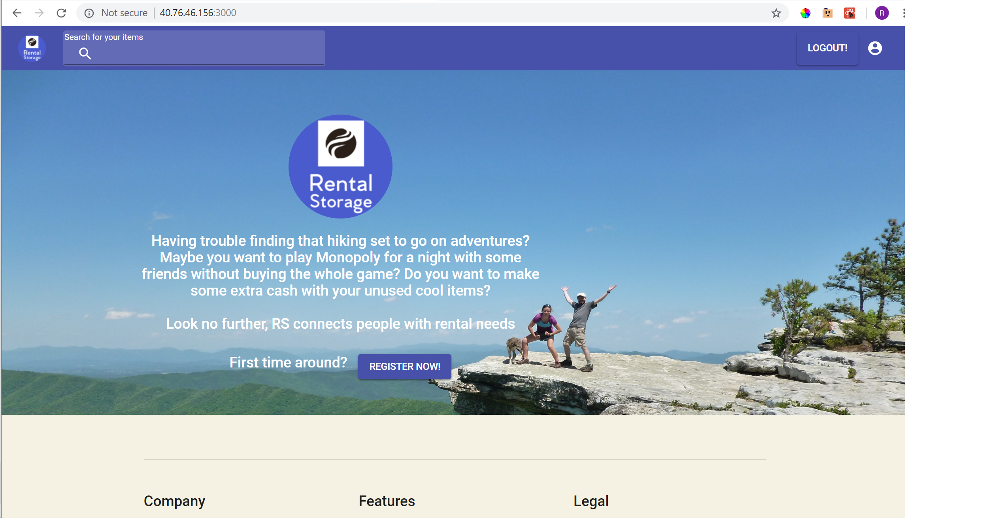

# Redesigned-BeOmni

## Table of Contents
- [Demo](#demo)
- [Objectives](#objectives)
- [Technologies](#technologies)
- [Authors](#authors)
- [Quickstart](#quickstart)
- [Preview](#preview)
- [Copyright and license](#copyright-and-license)

## Demo
http://40.76.46.156:3000
## Objectives
- Create an useful platform that helps with a real world problem

- Make the first steps towards a business idea

- Follow the accessibility standards provided from Lighthouse and Ax Chrome extensions.

## Technologies
- meteor, mongodb, react, reactstrap, material-ui and many more libraries... 

## Authors:
- Ricardo Enrique Gonzalez Penuela: https://rgonzalezp.github.io/
- Esteban Galvis: https://tebandesade.github.io/

## Quickstart:
- Small note: You need to have installed mongodb and meteor to make the necessary imports to the mongo database and run the app
- ```meteor npm install``` to install node modules in the project folder
- ```meteor``` to deploy the local server
## Google apiKey:
- Inside the react components folder imports/ui/App , you need to add a file called "shhkey.js" with your google api key.

## Preview



## Copyright and license
Code Copyright 2018 Ricardo Enrique Gonzalez Peñuela, Esteban Galvis. Code released under the MIT license.


